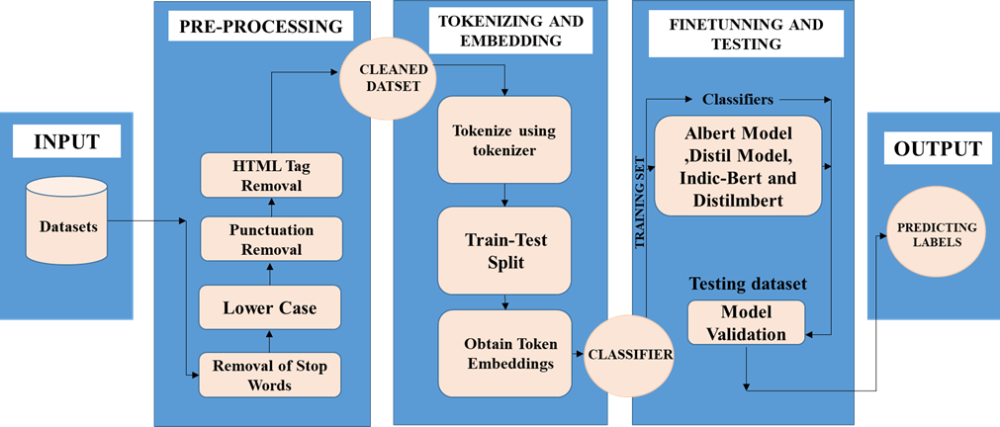
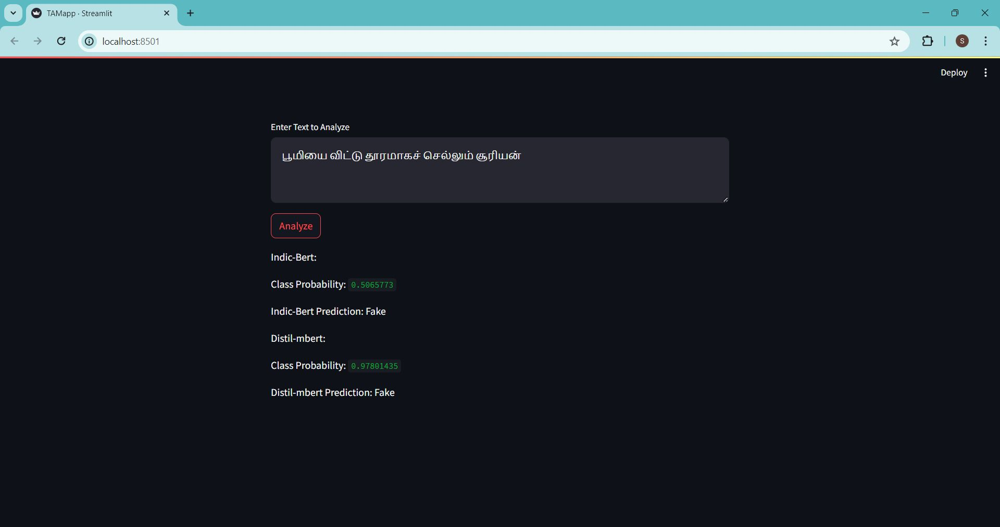

<div align='center'>
    <h1>Fake News Detection in Tamil and English</h1>
</div>

<i>

## Overview
A multilingual fake news detection system that uses Transformer-based deep learning models to classify news articles in Tamil and English as real or fake. The project leverages state-of-the-art NLP techniques and machine learning models to analyze text authenticity.

## Contents
- [Problem Statement](#problem-statement)
- [Solution Approach](#solution-approach)
- [Workflow](#workflow)  
- [Data Collection](#data-collection)
- [Data Preprocessing](#data-preprocessing)
- [Model Training & Evaluation](#model-training--evaluation)
- [Usage](#usage)
- [UserInterface](#userinterface)
- [Future Enhancements](#future-enhancements)

## Problem Statement
Fake news spreads quickly on social media, leading to misinformation, societal harm, and political manipulation. This project aims to develop an AI-based solution that can automatically verify the authenticity of news in both Tamil and English languages.

## Solution Approach
- Utilizes pre-trained **BERT-based models** fine-tuned for fake news classification.
- Models used:
  - **English**: DistilBERT, ALBERT
  - **Tamil**: DistilMBERT, IndicBERT
- The system is deployed as a **Streamlit-based web application**, allowing users to submit news articles for verification.

## Workflow
<div align='center'>
    
</div>

## Data Collection
- Datasets collected from **Kaggle** and other public sources.
- **English dataset**: 16,527 articles
- **Tamil dataset**: 5,227 articles
- Categories: Politics, Healthcare, Sports, Cinema, COVID-19 etc.

## Data Preprocessing
- **Text normalization** (lowercasing, punctuation removal)
- **Stopword removal**
- **Tokenization and vectorization**
- **Balancing dataset for improved accuracy**

## Model Training & Evaluation
- **Results**:
  - **English Models**:
    - DistilBERT: **85.69% Accuracy**
    - ALBERT: **85.14% Accuracy**
  - **Tamil Models**:
    - DistilMBERT: **82.02% Accuracy**
    - IndicBERT: **75.81% Accuracy**

## Usage
1. Clone the repository:
   ```sh
   git clone https://github.com/ShivaniKrishnaKumar/Fake_News_Detection.git
   ```
2. Navigate to the project directory:
   ```sh
   cd Fake_News_Detection
   ```
3. Install dependencies:
   ```sh
   pip install -r requirements.txt
   ```
4. Run the Streamlit application:
   ```sh
   streamlit run app.py
   ```

## UserInterface
<div align='center'>
    
</div>
<div align='center'>
    
</div>
   
## Future Enhancements
- **Multimodal Analysis**: Include images and videos for verification
- **Real-time News Analysis**: Scrape live news feeds for automatic classification
- **Continuous Learning**: Adaptive models for evolving fake news patterns

</i>

